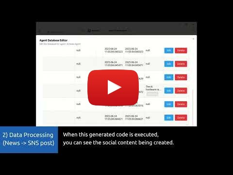

# Zentrun — One Prompt, Complete Automation

**"Send yesterday's sales to Slack every morning at 9 AM"**
This single sentence becomes working automation.

No setup wizards. No workflow builders. No API configurations.
**Just describe what you want.**

---

## 🎯 What You Can Build

### **Business Intelligence**
```
"Collect daily sales data, compare to targets, identify trends, send executive summary"
→ Complete BI pipeline with data collection, analysis, and reporting
```

### **Data Analysis & ML**
```
"Analyze customer churn patterns and build prediction models"
→ Data exploration + ML training + predictive insights
```

### **Competitive Monitoring**
```
"Track competitor websites for pricing changes, analyze impact, suggest responses"
→ Web monitoring + analysis + strategic recommendations
```

### **Customer Intelligence**
```
"Monitor support tickets, classify by urgency and topic, predict escalation needs"
→ Ticket analysis + ML classification + predictive insights
```

### **Content Operations**
```
"Find trending topics, generate content ideas, schedule posts, track performance"
→ Research + content creation + scheduling + analytics
```

Everything that you want can be automated.

---

## 🎬 See It Working

**Real demo: Complete marketing automation from prompts**

[](https://youtu.be/HcqcrWb2jxA)

Watch a marketing workflow get built with just natural language:
1. Collects AI news from multiple sources
2. Summarizes content with AI analysis
3. Posts automatically to Twitter
4. Analyzes engagement patterns
5. Visualizes results in dashboard

**Each step generated from language. No manual configuration.**

---

## 🚀 Installation

| Platform         | Download                                                                                                  |
|------------------|---------------------------------------------------------------------------------------------------------|
| Windows          | [Download](https://download.zentrun.com/Zentrun%20Setup%200.0.1.exe)                                    |
| macOS            | [Download](https://download.zentrun.com/Zentrun-0.0.1-mac-x64.dmg)                     |
| Linux            | [Download](https://download.zentrun.com/Zentrun-0.0.1-linux-x64.tar.gz)           |

```bash
# Or build from source
git clone https://github.com/andrewsky-labs/zentrun
cd zentrun
yarn && yarn dev
```

---

## 💭 Why Automation Still Feels Like Work

### **The "AI-Assisted" Reality**

**Zapier with AI**
- ❌ "AI helps you build workflows" → Still need to configure triggers, actions, connections
- ❌ "Natural language setup" → AI generates workflow, you still need to understand their interface

**Make.com with AI Agents**
- ❌ "AI Agents automate tasks" → Agents work within workflows you build with drag-and-drop
- ❌ "Conversational automation" → Conversation helps configure, doesn't replace configuration

**Power Automate with Copilot**
- ❌ "Describe your workflow" → Generates Power Platform flows, still need to set up connections
- ❌ "Natural language flows" → You still debug in their visual interface

### **Zentrun's Approach**

```
💬 "Monitor competitor prices and alert me when they change significantly"
→ Running automation. No setup. No configuration. No workflow building.

💬 "Analyze customer feedback, identify trends, create weekly summary"
→ Complete pipeline from data collection to analysis to reporting.

💬 "Track our mentions on social media, classify sentiment, escalate negatives"
→ Full monitoring and response system with ML classification.
```

**The difference**: Others help you build automation. Zentrun just automates.


---

## 🔧 How This Is Possible

### **Browser-Native Execution**
- Uses your existing browser sessions (no API keys needed)
- Inherits all your login credentials automatically
- Handles complex web interactions like a human
- Bypasses API limitations and rate limits

### **AI-Powered Code Generation**
- Converts natural language to executable Python/SQL/JavaScript
- Generates browser automation scripts
- Creates data analysis workflows
- Builds ML training and inference pipelines

### **Local Processing Power**
- Fast local database (SQLite/DuckDB) for data operations
- Built-in ML libraries for custom model training
- Real-time analysis without cloud dependencies
- Complete workflow execution on your machine

### **Intelligent Adaptation**
- Self-healing when websites change
- Learning from successful automation patterns
- Context-aware decision making
- Automatic error recovery and retry logic

---
---

## 🛠️ Technical Architecture

### **Natural Language Processing**
- Advanced prompt parsing and intent recognition
- Context-aware code generation for automation logic
- Multi-step workflow planning from single descriptions
- Error recovery and script refinement

### **Browser Integration**
- Chrome DevTools Protocol for seamless browser control
- Session inheritance for instant access to logged-in services
- JavaScript execution environment for dynamic interactions
- Anti-detection techniques for reliable web automation

### **Data & ML Pipeline**
- SQLite/DuckDB for high-performance local analytics
- Vector databases for embedding storage and retrieval
- scikit-learn, TensorFlow, PyTorch for ML workflows
- Real-time inference and model serving capabilities

### **Execution Engine**
- Parallel processing for complex multi-step automations
- Intelligent scheduling and resource management
- Fault tolerance with automatic retry mechanisms
- Version control and rollback for automation logic

---

## 📋 Getting Started

### **Start Simple**
```
1. Install Zentrun
2. Try: "Summarize my unread emails from today"
3. Watch it work in your browser
4. Add more complex automations gradually
```

### **Common Use Cases**
- Daily email and calendar summaries
- Social media monitoring and analysis
- Competitive intelligence gathering
- Customer feedback analysis
- Financial reporting automation

### **Advanced Workflows**
- Multi-source data integration pipelines
- Custom ML model training on your data
- Complex decision-making automations
- Real-time monitoring and alerting systems
- Reusable MCP workflows (Save as Zent)

## 🤖 Supported Model Providers

<table>
  <tr align="center">
    <td>
      <br/>
      <a href="https://ollama.com">Ollama</a>
    </td>
    <td>
      <br/>
      <a href="https://deepseek.com/">Deepseek</a>
    </td>
    <td>
      <br/>
      <a href="https://www.siliconflow.cn/">Silicon</a>
    </td>
    <td>
      <br/>
      <a href="https://chat.qwenlm.ai">QwenLM</a>
    </td>
  </tr>
  <tr align="center">
    <td>
      <br/>
      <a href="https://console.volcengine.com/ark/">Doubao</a>
    </td>
    <td>
      <br/>
      <a href="https://platform.minimaxi.com/">MiniMax</a>
    </td>
    <td>
      <br/>
      <a href="https://fireworks.ai/">Fireworks</a>
    </td>
    <td>
      <br/>
      <a href="https://ppinfra.com/">PPIO</a>
    </td>
  </tr>
  <tr align="center">
    <td>
      <br/>
      <a href="https://openai.com/">OpenAI</a>
    </td>
    <td>
      <br/>
      <a href="https://gemini.google.com/">Gemini</a>
    </td>
    <td>
      <br/>
      <a href="https://github.com/marketplace/models">GitHub Models</a>
    </td>
    <td>
      <br/>
      <a href="https://moonshot.ai/">Moonshot</a>
    </td>
  </tr>
  <tr align="center">
    <td>
      <br/>
      <a href="https://openrouter.ai/">OpenRouter</a>
    </td>
    <td>
      <br/>
      <a href="https://azure.microsoft.com/en-us/products/ai-services/openai-service">Azure OpenAI</a>
    </td>
    <td>
      <br/>
      <a href="https://www.qiniu.com/products/ai-token-api">Qiniu</a>
    </td>
    <td>
      <br/>
      <a href="https://x.ai/">Grok</a>
    </td>
  </tr>
</table>

** Compatible with any model provider in OpenAI/Gemini/Anthropic API format

## ✨  System Requirements
Minimum specs for a decent experience:

macOS: 13.6+ (8GB RAM for 3B models, 16GB for 7B, 32GB for 13B)
Windows: 10+ with GPU support for NVIDIA/AMD/Intel Arc
Linux: Most distributions work, GPU acceleration available

## ✨  Contributing

Please refer to [Contribution Guide](https://github.com/andrewsky-labs/zentrun/CONTRIBUTING.md).


## 📃 License

[LICENSE](./LICENSE)

---

**Stop building workflows. Start describing what you want.**
**Automation that actually understands natural language.**

⭐ **Star if you want automation to work like you always thought it should!**
