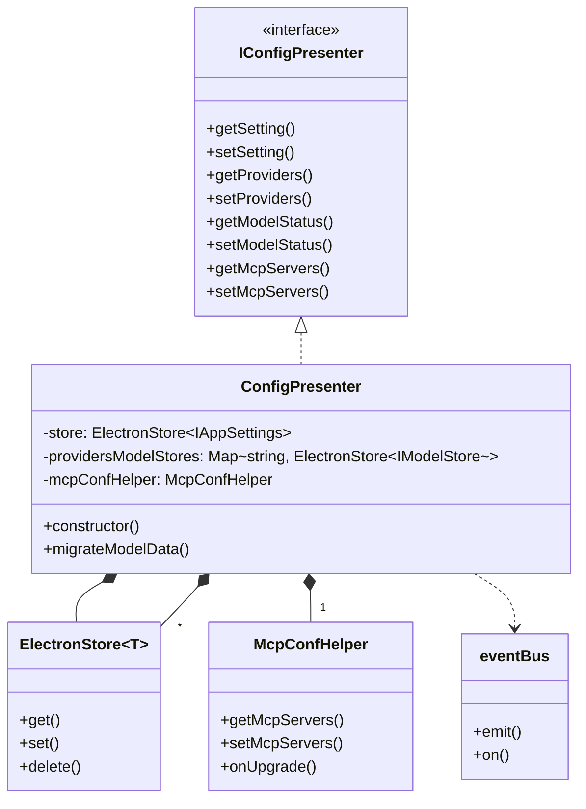
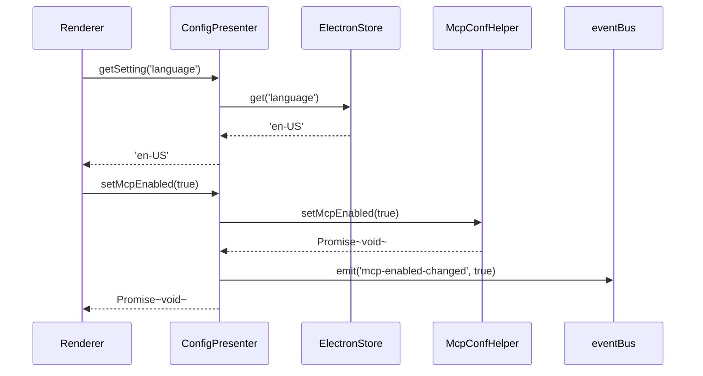
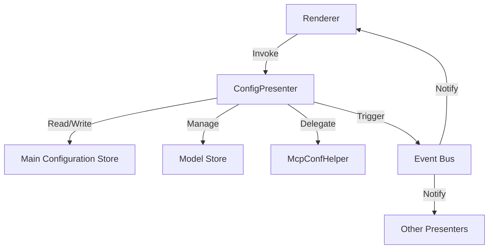

# 🧩 ConfigPresenter Architecture

## 📘 Class Diagram



---

## 🔄 Data Flow Diagram



---

## 🗂 Storage Structure

### 📁 Main Configuration (`app-settings.json`)

```json
{
  "language": "en-US",
  "providers": [
    {
      "id": "openai",
      "name": "OpenAI",
      "apiKey": "sk-...",
      "enable": true
    }
  ],
  "model_status_openai_gpt-4": true,
  "proxyMode": "system",
  "syncEnabled": false
}
```

### 📁 Model Configuration (`models_openai.json`)

```json
{
  "models": [
    {
      "id": "gpt-4",
      "name": "GPT-4",
      "maxTokens": 8192,
      "vision": false,
      "functionCall": true
    }
  ],
  "custom_models": [
    {
      "id": "gpt-4-custom",
      "name": "GPT-4 Custom",
      "maxTokens": 8192
    }
  ]
}
```

---

## 🔧 Component Interaction



---

## 🔑 Key Design Points

1. **Interface Segregation**: Define public APIs via the `IConfigPresenter` interface.
2. **Single Responsibility**: `McpConfHelper` handles all MCP-related logic.
3. **Event Driven**: Changes in configuration are communicated via the event bus.
4. **Version Compatibility**: Built-in data migration mechanism.
5. **Type Safety**: Generic interfaces are used to ensure type safety.
