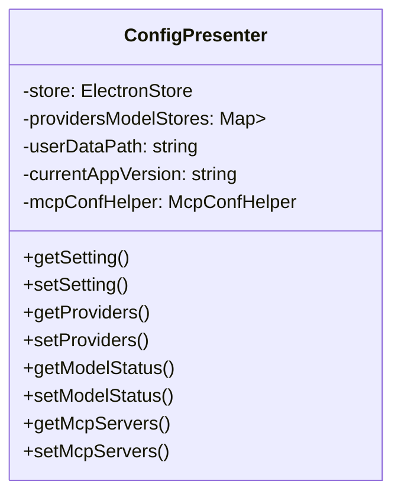
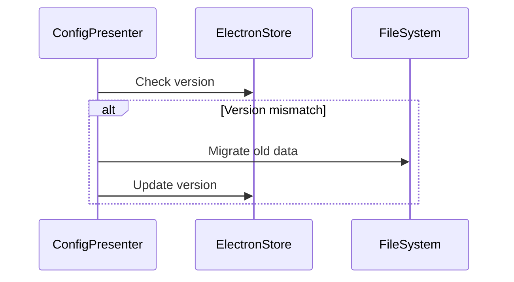

# 📘 ConfigPresenter Module Design Document

## 🔍 Functional Overview

`ConfigPresenter` is the core configuration management module of **Zentrun**, responsible for handling various application settings, including:

1. Basic app settings (language, proxy, sync, etc.)
2. LLM provider configurations
3. Model management (standard and custom models)
4. MCP (Model Control Protocol) server configurations
5. Data migration and version compatibility

---

## 🧱 Core Architecture

### 1. Storage Structure

ConfigPresenter uses a layered storage design:

- **Main configuration storage**: Uses `ElectronStore` for basic app settings
- **Model storage**: Each LLM provider has its own independent `ElectronStore` instance
- **Status storage**: Model enabled states are stored separately in the main config



---

### 2. Main Interfaces

#### App Setting Management

- `getSetting<T>(key: string): T | undefined`
- `setSetting<T>(key: string, value: T): void`

#### Provider Management

- `getProviders(): LLM_PROVIDER[]`
- `setProviders(providers: LLM_PROVIDER[]): void`
- `getProviderById(id: string): LLM_PROVIDER | undefined`
- `setProviderById(id: string, provider: LLM_PROVIDER): void`

#### Model Management

- `getProviderModels(providerId: string): MODEL_META[]`
- `setProviderModels(providerId: string, models: MODEL_META[]): void`
- `getCustomModels(providerId: string): MODEL_META[]`
- `setCustomModels(providerId: string, models: MODEL_META[]): void`
- `addCustomModel(providerId: string, model: MODEL_META): void`
- `removeCustomModel(providerId: string, modelId: string): void`

#### MCP Configuration Management

- `getMcpServers(): Promise<Record<string, MCPServerConfig>>`
- `setMcpServers(servers: Record<string, MCPServerConfig>): Promise<void>`
- `getMcpEnabled(): Promise<boolean>`
- `setMcpEnabled(enabled: boolean): Promise<void>`

---

### 3. Event System

`ConfigPresenter` uses an `eventBus` to emit configuration change events:

| Event Name                           | Trigger Condition               | Parameters                     |
|-------------------------------------|---------------------------------|--------------------------------|
| CONFIG_EVENTS.SETTING_CHANGED       | When any setting changes        | key, value                     |
| CONFIG_EVENTS.PROVIDER_CHANGED      | When provider list is updated   | -                              |
| CONFIG_EVENTS.MODEL_STATUS_CHANGED  | When a model's status changes   | providerId, modelId, enabled   |
| CONFIG_EVENTS.MODEL_LIST_CHANGED    | When model list is updated      | providerId                     |
| CONFIG_EVENTS.PROXY_MODE_CHANGED    | When proxy mode changes         | mode                           |
| CONFIG_EVENTS.CUSTOM_PROXY_URL_CHANGED | When custom proxy URL changes | url                            |
| CONFIG_EVENTS.ARTIFACTS_EFFECT_CHANGED | When animation settings change | enabled                        |
| CONFIG_EVENTS.SYNC_SETTINGS_CHANGED | When sync settings change       | { enabled, folderPath }        |
| CONFIG_EVENTS.CONTENT_PROTECTION_CHANGED | When casting protection changes | enabled                     |
| CONFIG_EVENTS.SEARCH_ENGINES_UPDATED | When search engine settings change | engines                    |

---

### 4. Data Migration

`ConfigPresenter` includes a version-aware data migration mechanism:



Migration logic includes:

1. Moving model data from the main config to individual stores
2. Separating model status into dedicated storage
3. Fixing URL format for specific providers

---

## 🧪 Usage Examples

### Get Current Language Setting

```typescript
const language = configPresenter.getLanguage()
```

### Add Custom Model

```typescript
configPresenter.addCustomModel('openai', {
  id: 'gpt-4-custom',
  name: 'GPT-4 Custom',
  maxTokens: 8192
  // ...other properties
})
```

### Enable MCP

```typescript
await configPresenter.setMcpEnabled(true)
```

---

## 💡 Best Practices

1. **Accessing settings**: Always use `getSetting` / `setSetting` methods instead of directly accessing the store.
2. **Event listening**: Components interested in config changes should listen to events instead of polling.
3. **Model management**: Always use the provided methods to manage custom models.
4. **Version compatibility**: When adding new config fields, ensure defaults and migration logic are defined.

---

## 🔧 Extensibility Design

1. **IAppSettings Interface**: Uses index signature to allow dynamic keys.
2. **McpConfHelper**: Isolates MCP logic in a separate helper class.
3. **Provider Identification**: Uses dynamic `providerId` strings instead of enums to support future providers.
