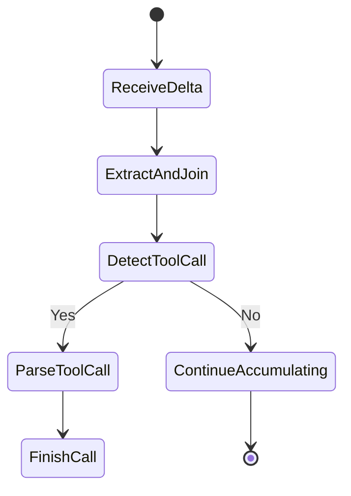
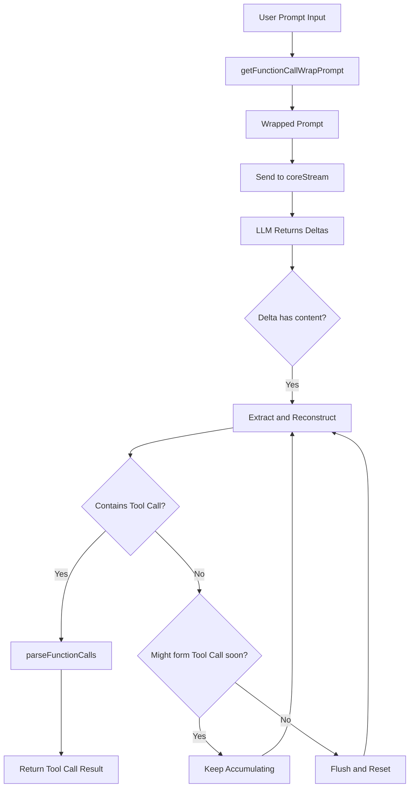
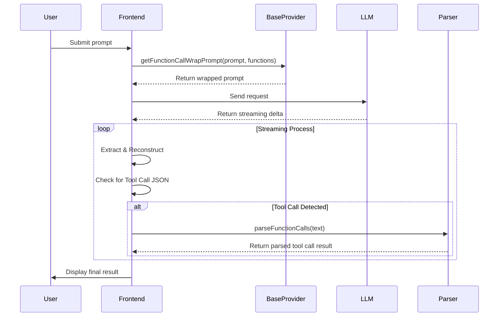

# 🛠️ Zentrun Tool Use Technical Documentation

## 🎯 Background & Objectives

With the advancement of LLMs supporting **Function Calling**, Zentrun simulates **Tool Use behavior** via **prompt engineering**, even without relying on native function calling.

**Design goals**:
- Standardize prompt wrapping to guide LLMs in invoking tools with structured JSON
- Ensure compatibility across all LLMs, including those without native Function Calling support
- Support multi-tool invocation and complex orchestration scenarios

---

## 🧱 Structural Overview

| Component                      | Description                                                             |
|-------------------------------|-------------------------------------------------------------------------|
| `baseProvider.ts`             | Defines base prompt wrapping and tool use logic                         |
| `openAICompatibleProvider.ts` | Implements OpenAI-compatible interaction and function call parsing       |
| Core Functions                 | `getFunctionCallWrapPrompt`, `coreStream`, `parseFunctionCalls`         |

---

## 🔁 Overall Flow

1. **Prompt Wrapping**: Use `getFunctionCallWrapPrompt` to wrap user input with available tools
2. **Streaming**: Send the wrapped prompt to the LLM via `coreStream`, receive deltas
3. **Function Parsing**: Extract Tool Call JSONs using `parseFunctionCalls`

---

## 🔍 Core Module Details

### 1. `getFunctionCallWrapPrompt(prompt, functions)`

**Purpose**:
> Wraps the original user prompt along with the list of tools, guiding the LLM to respond in a structured JSON format.

**Key Logic**:
- List all functions with names and parameter schema
- Enforce output format such as:
```json
{ "tool_name": "xxx", "parameters": { "key": "value" } }
```
- Embed user prompt naturally within the structure

**Concept**:
Let even non-native LLMs understand "you can call a tool" through contextual formatting.

---

### 2. `coreStream(config)`

**Purpose**:
> Manages streaming requests and delta responses from the LLM in real-time.

**Details**:
- On receiving each delta:
  - Check for `content`
  - Reconstruct characters to maintain valid JSON
  - Wrap responses cleanly to prevent truncation or disorder
- Reassembly logic:
  - Detect if delta starts with tool call patterns (e.g., `{ "tool_name"`)
  - Combine potentially split content
- On identifying complete tool call JSON, immediately invoke `parseFunctionCalls`

**State Machine Flow**:
The process follows a state machine to manage each delta segment step-by-step:



---

### 3. `parseFunctionCalls(text)`

**Purpose**:
> Extract structured Tool Call JSON(s) from LLM's natural language output and convert to JS Object(s).

**Main Logic**:
- Use regex to find JSON patterns `{...}`
- Support multiple tool calls in a single output
- Implement fault tolerance for malformed JSON (e.g., missing quotes, unescaped characters)

---

## 🧭 Overall Flow Diagram (Mermaid)



---

## ⏱ Sequence Diagram (Mermaid)



---

## ✨ Design Highlights

- **Smart Prompt Wrapping**: Enables tool use even for models without native support
- **Character-Level Streaming Logic**: Reconstructs tool calls precisely
- **High Fault Tolerance**: Handles irregular, nested, or concurrent tool call formats

---

## 🔮 Future Enhancements

- Adaptive prompt tuning based on LLM model
- Support for nested tool calls (tools calling other tools)
- Stateful tool call tracking across multi-turn conversations
