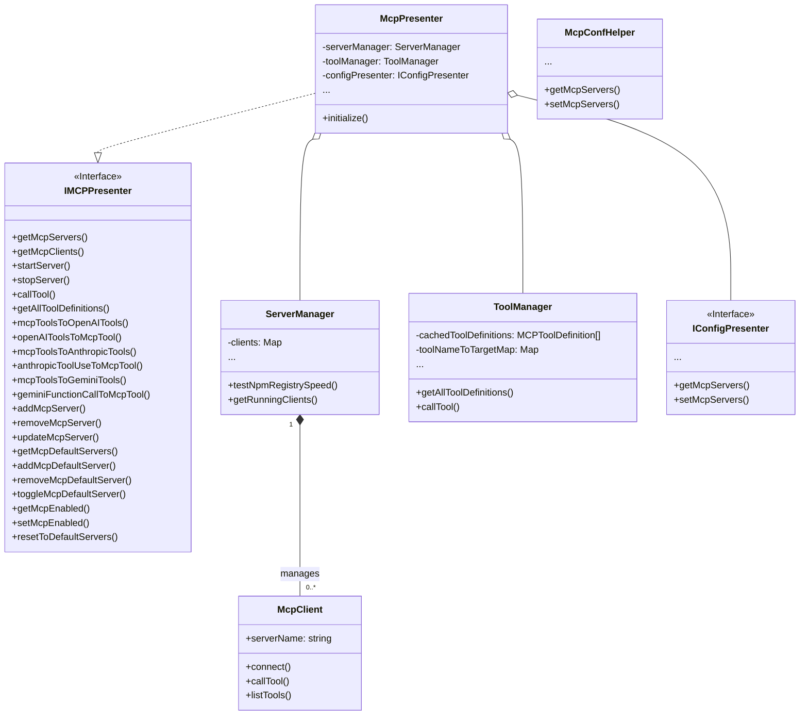
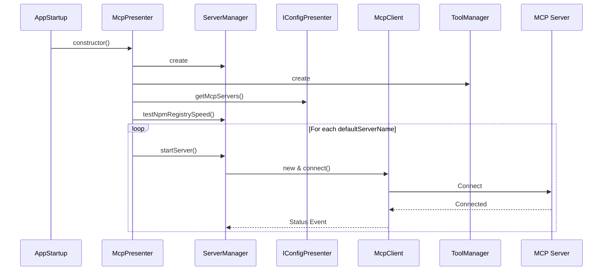
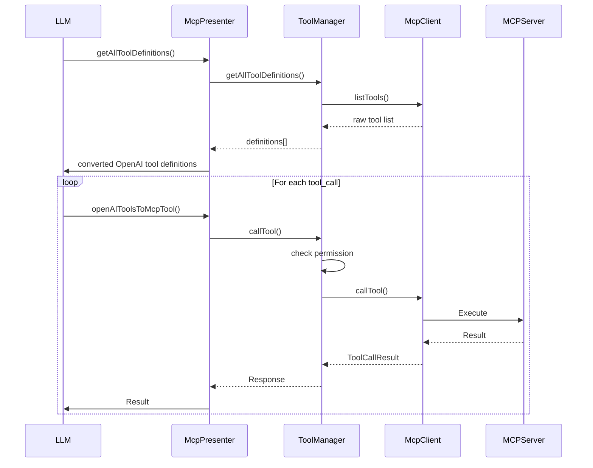

# 🧠 MCP Presenter Architecture Document

## 🧩 Module Overview

The **MCP (Model Context Protocol) Presenter** is the core module in Zentrun responsible for managing MCP servers and tools. Its key responsibilities include:

1. **MCP Server Management** – Starting, stopping, configuring, default server setup, and npm registry speed testing
2. **MCP Tool Management** – Tool discovery, name conflict handling, caching, permission checks, and invocation
3. **LLM Adaptation** – Converting MCP tool definitions to formats compatible with LLM providers (OpenAI, Anthropic, Gemini)
4. **State and Events** – Monitoring server state and emitting related events via `eventBus`

---

## 🧱 Core Components

---

## 🔄 Data Flow

### 1. Initialization & Default Server Start

### 2. Tool Call Flow (e.g., OpenAI)

---

## 🧩 Key Design Highlights

### 1. **Layered Architecture**

- **Interface Layer**: `IMCPPresenter` defines public methods
- **Presenter Layer**: `McpPresenter` coordinates logic, delegates to managers
- **Manager Layer**: `ServerManager` & `ToolManager` manage runtime logic
- **Config Layer**: `IConfigPresenter` & `McpConfHelper` handle settings
- **Client Layer**: `McpClient` communicates with individual MCP servers

### 2. **Multi-Protocol Support**

- `McpClient` can handle `stdio`, `sse`, `http`, and `in-memory` protocols via `Transport` abstraction

### 3. **Tool Management & Adaptation**

- `ToolManager` handles:
  - Tool discovery
  - Name conflict resolution
  - Mapping/caching tool definitions
- `McpPresenter` handles:
  - Format conversions between MCP ↔ OpenAI/Anthropic/Gemini
- `toolNameToTargetMap`: used for accurate routing to original tools & clients

### 4. **Configuration-Driven Behavior**

- Configurations are stored and loaded via `McpConfHelper`
- Uses `electron-store` for persistence

### 5. **Error Handling & Events**

- Errors handled at each layer (server start, tool call, etc.)
- All status/state changes are emitted via `eventBus`

### 6. **Performance & Environment Optimization**

- `ServerManager` benchmarks npm registries to select the fastest
- `McpClient` carefully injects env vars (e.g., PATH, proxies, registry) for `stdio` tools

