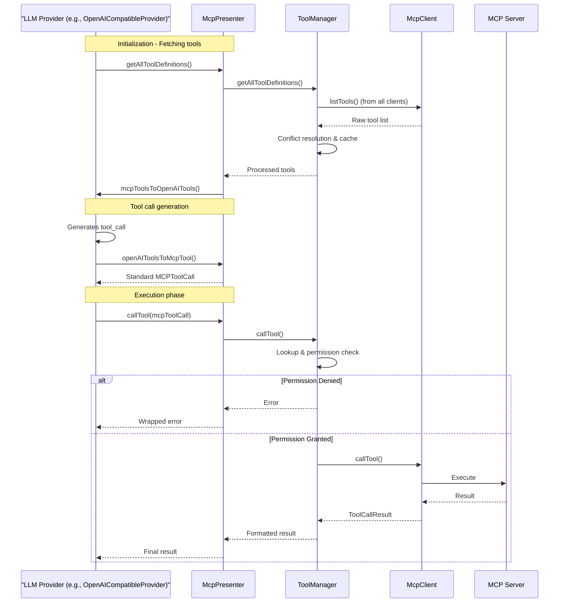

# MCP Presenter Design Document

## 1. Core Class Design

### 1.1 McpPresenter

`McpPresenter` (`src/main/presenter/mcpPresenter/index.ts`) is the main entry point of the module, implementing the `IMCPPresenter` interface. Key responsibilities include:

- Depends on `IConfigPresenter` to retrieve configuration.
- Initializes and manages `ServerManager` and `ToolManager`.
- **Initialization workflow**:
  - Tests npm registry speed (via `ServerManager`).
  - Starts default MCP servers based on configuration.
- Provides APIs to manage server lifecycle (start/stop), configurations, and default server settings.
- Retrieves all available tool definitions (via `ToolManager`) and resolves naming conflicts.
- Converts between MCP tool formats and formats used by different LLM providers (OpenAI, Anthropic, Gemini).
- Receives tool invocation requests from LLM providers, standardizes them, and forwards to `ToolManager`.
- Triggers MCP-related events via `eventBus`.

**Key Methods**:
- `initialize()`: Performs initialization logic.
- Server management: `getMcpServers()`, `startServer()`, `stopServer()`, `addMcpServer()`, `removeMcpServer()`, `updateMcpServer()`.
- Default server management: `getMcpDefaultServers()`, `addMcpDefaultServer()`, `removeMcpDefaultServer()`, `toggleMcpDefaultServer()`.
- Tool handling: `getAllToolDefinitions()`, `callTool()`.
- Format conversions: `mcpToolsToOpenAITools()`, `openAIToolsToMcpTool()`, `mcpToolsToAnthropicTools()`, `anthropicToolUseToMcpTool()`, `mcpToolsToGeminiTools()`, `geminiFunctionCallToMcpTool()`.
- Global toggle: `getMcpEnabled()`, `setMcpEnabled()`.
- Resetting configuration: `resetToDefaultServers()`.

### 1.2 ServerManager

`ServerManager` (`src/main/presenter/mcpPresenter/serverManager.ts`) manages the lifecycle of MCP server instances (`McpClient`):

- **NPM Registry Management**:
  - Automatically benchmarks multiple npm registries (`NPM_REGISTRY_LIST`) to select the fastest.
  - Selected registry is passed to `McpClient` instances.

- **Client Management**:
  - Maintains a map of running `McpClient` instances.
  - Provides methods to start (`startServer`) and stop (`stopServer`) servers.
  - Retrieves default or currently running clients.

- Handles error notifications for failed server launches.
- Triggers `MCP_EVENTS.CLIENT_LIST_UPDATED`.

### 1.3 ToolManager

`ToolManager` (`src/main/presenter/mcpPresenter/toolManager.ts`) is responsible for managing and invoking MCP tools:

- **Tool Definition & Caching**:
  - Retrieves tool definitions from all running `McpClient`s via `listTools`.
  - **Conflict Resolution**: Renames tools with the same name from different servers using the format `serverName_toolName`.
  - Caches processed tool definitions (`cachedToolDefinitions`) and maintains a name-to-target map (`toolNameToTargetMap`).
  - Listens to `MCP_EVENTS.CLIENT_LIST_UPDATED` to invalidate cache.

- **Tool Invocation**:
  - `callTool()`: Accepts standardized `MCPToolCall` request.
  - Looks up the target client and original tool name using the map.
  - Permission check via `checkToolPermission()` using `autoApprove` rules from server config.
  - Invokes the target `McpClient` using the *original* tool name.
  - Formats result and triggers `MCP_EVENTS.TOOL_CALL_RESULT`.

### 1.4 McpClient

`McpClient` (`src/main/presenter/mcpPresenter/mcpClient.ts`) handles communication with a single MCP server.

- **Transport & Communication**:
  - Manages connection (`connect`) and disconnection (`disconnect`).
  - Supports multiple transport layers: `stdio`, `sse`, `http`, `inmemory`.
  - Executes tools, lists tools, reads resources.

- **Environment & Config**:
  - Merges and applies environment variables for `stdio` transport (PATH, proxy).
  - Uses `npmRegistry` from `ServerManager`.
  - Supports authentication and custom headers.

- **Connection Management**:
  - 5-minute timeout for connections.
  - Triggers `MCP_EVENTS.SERVER_STATUS_CHANGED`.

---

## 2. Tool Invocation Flow (OpenAI Example)



---

## 3. Event System

The MCP Presenter module uses `eventBus` to emit the following events:

| Event Name                        | Triggered When                    | Source         | Payload                                                   |
| -------------------------------- | --------------------------------- | -------------- | --------------------------------------------------------- |
| `MCP_EVENTS.SERVER_STARTED`      | Server successfully started       | McpPresenter   | `serverName`                                              |
| `MCP_EVENTS.SERVER_STOPPED`      | Server stopped                    | McpPresenter   | `serverName`                                              |
| `MCP_EVENTS.TOOL_CALL_RESULT`    | Tool invocation completed         | ToolManager    | `MCPToolResponse`                                         |
| `MCP_EVENTS.CONFIG_CHANGED`      | Config (server/defaults/enabled)  | McpConfHelper  | `{ mcpServers, defaultServers, mcpEnabled }`              |
| `MCP_EVENTS.SERVER_STATUS_CHANGED` | Server connection status changed | McpClient      | `{ name: string, status: 'running' | 'stopped' }`         |
| `MCP_EVENTS.CLIENT_LIST_UPDATED` | Running clients list updated      | ServerManager  | (no payload)                                              |

---

## 4. Configuration Management

MCP-related configurations are handled by `McpConfHelper` (`src/main/presenter/configPresenter/mcpConfHelper.ts`) and stored using ElectronStore (`mcp-settings`).

**Key Configs**:

- `mcpServers`: `Record<string, MCPServerConfig>` - All defined MCP servers.
- `defaultServers`: `string[]` - Servers to auto-start.
- `mcpEnabled`: `boolean` - Global toggle for MCP features.

**MCPServerConfig Interface**:

```ts
interface MCPServerConfig {
  command?: string
  args?: string[]
  env?: Record<string, string>
  type?: 'stdio' | 'sse' | 'http' | 'inmemory'
  baseUrl?: string
  autoApprove?: string[]
  icons?: string
  descriptions?: string
  disable?: boolean
  customHeaders?: Record<string, string>
}
```

---

## 5. Extension Guide

### 5.1 Add New Server Type

1. Add a new transport type in `McpClient` (implement `Transport` interface).
2. Update `MCPServerConfig` type definition if new fields are required.
3. Extend `connect` method in `McpClient` to handle the new type.
4. Update `ServerManager` if needed.

### 5.2 Add New Tool Format Conversion

1. Add new conversion methods in `McpPresenter` (e.g., `mcpToolsToNewFormat()`).
2. Add reverse conversion methods (e.g., `newFormatToMcpTool()`).
3. Update corresponding LLM provider logic.

### 5.3 Custom Permission Control

1. Update `ToolManager.checkToolPermission()` logic.
2. Modify `MCPServerConfig` if new permission syntax is required.
3. Update documentation and UI for new rules.
